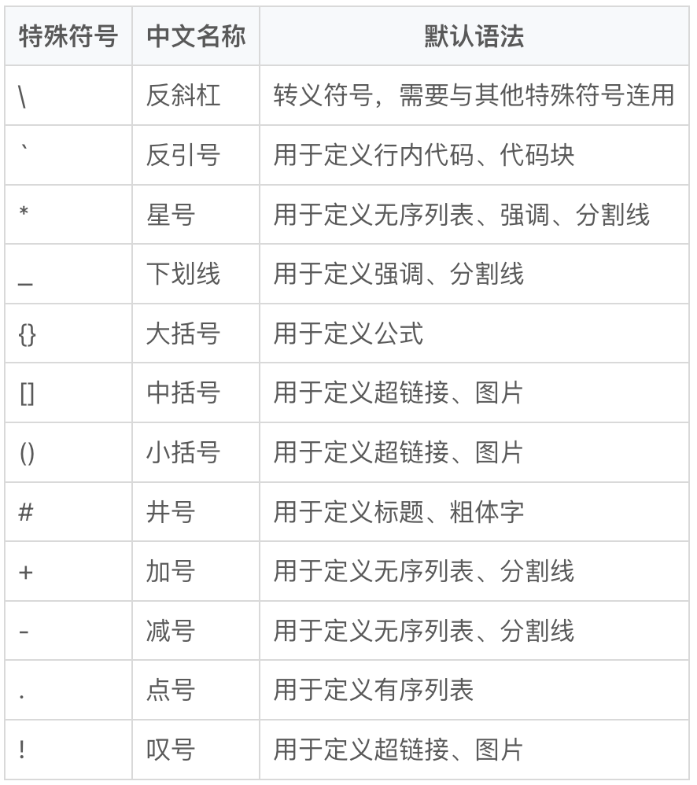

#### Markdown 的源文件以 md 为后缀。Markdown 是 HTML 语法的简化版本，它本身不带有任何样式信息。
- [参考网页1](https://www.5axxw.com/wiki/content/8jreav)
- [markdowntutorial](https://www.markdowntutorial.com/)
# 1  \markdown 段落
## SeText style
这是整篇文章的题目
===
这是一个章节题目
---
## Atx style
采用 # ## ### 来区别标题之间的区别


# 2\注释
<!-- 这是一段被注释掉的文字 -->
<div style="display:none">
这是一段被注释掉的文字
</div>

# 3\段落
## 3.1段落1（采用空行来区分，，<p>标签来描述段落）
这是第一段正文文字的第一句。
这是第一段正文文字的第二句。这是第一段正文文字的第三句。

这是第二段正文文字的第一句。
这是第二段正文文字的第二句。
## 3.2不分段换行（行尾增加两个空格,<br>标签来描述段落）
这是第一段正文文字的第一句。  
这是第一段正文文字的第二句。这是第一段正文文字的第三句。

这是第二段正文文字的第一句。
这是第二段正文文字的第二句。

## 3.3 缩进
### 3.3.1 配置全局段落样式
<p style="text-indent:2em">
正文第二段。正文第二段。正文第二段。正文第二段。
正文第二段。正文第二段。正文第二段。正文第二段。
正文第二段。正文第二段。正文第二段。正文第二段。
正文第二段。正文第二段。正文第二段。正文第二段。
正文第二段。正文第二段。<p>
<!-- 全局缩进的标志，css放在最后面 <style>p{text-indent:2em}</style>
-->

### 3.3.2 使用转义字符
第一段为没有缩进的英文段落，第二段为使用转义符号缩进的英文段落。  
be or no to be, that is a question.

&emsp;&emsp;be or no to be, that is a question.  
<!--
一个字：全方大的空白&emsp;或&#8195;空白
½个字：半方大的空白&ensp;或&#8194;空白
⅓个字：不断行的空白&nbsp;或&#160;空白
-->

### 3.3.3 使用全角空格使用中文全角空格转义字符用^_^适合于中文文章。
　　^_^正文第一段。正文第一段,正文第一段。正文第一段。
这里在vs code内显示不正确，当时GitHub上是正确的，同时
### 3.3.4  空白行
在 Markdown 中，即使插入多个换行符，渲染时也会被合并成单一空行：  
开始结束。  
开始
结束。
#### 方法一 使用 html '\<br/\>' 标签实现空行插入：
开始
<br/>
<br/>
<br/>
结束。

#### 方法二 使用 '全角空格' 实现空行插入(注意行尾有两个空格)：
开始
　  
结束。
#### 方法三 使用转义字符 '\ ' 实现空行插入(注意行尾有两个空格)：
开始
&nbsp;
&nbsp;
结束。

### examples
### <p style = "text-align: center" >水调歌头·明月几时有
<p>

#### <p style = "text-align: center" > 苏轼 / 宋
<p>
<p style="text-indent:2em">
丙辰中秋，欢饮达旦，大醉，作此篇，兼怀子由.<br>
明月几时有？把酒问青天。
不知天上宫阙，今夕是何年。
我欲乘风归去，又恐琼楼玉宇，高处不胜寒。
起舞弄清影，何似在人间。<br>
转朱阁，低绮户，照无眠。不应有恨，何事长向别时圆？
人有悲欢离合，月有阴晴圆缺，此事古难全。
但愿人长久，千里共婵娟。
<p>

# 4.分割线
## 4.1 分割线声明 
使用「星号」作为分割线，（1）分界线

***

使用「减号」作为分割线（2）

---

使用「下划线」作为分割线（3）
___
## 4.2 分割线的样式
### 分割线的尺寸

#### 10px 宽线条
___

#### 20px 宽线条
___

#### 50px 宽线条
___

## 4.3 分割线类型
### 分割线的类型

#### 实线分隔线
___

#### 虚线分割线
___

#### 点状分割线
___

#### 双线分割线
___

#### 凹槽分割线
___

#### Inset分割线
___

#### Outset分割线
___

<style>hr {
  border-style: none !important;
  border-top-width: 5px !important;
}
hr:nth-of-type(4) {
  border-width: 10px 0 0 0 !important;
}
hr:nth-of-type(5) {
  border-width: 20px 0 0 0 !important;
}
hr:nth-of-type(6) {
  border-width: 50px 0 0 0 !important;
}
hr:nth-of-type(7) {
  border-top-style: solid !important;
}
hr:nth-of-type(8) {
  border-top-style: dashed !important;
}
hr:nth-of-type(9) {
  border-top-style: dotted !important;
}
hr:nth-of-type(10) {
  border-top-style: double !important;
}
hr:nth-of-type(11) {
  border-top-style: groove !important;
}
hr:nth-of-type(12) {
  border-top-style: ridge !important;
}
hr:nth-of-type(13) {
  border-top-style: inset !important;
  border-width: 20px 0 0 0 !important;
}
hr:nth-of-type(14) {
  border-top-style: outset !important;
}
</style>
## 4.4 Example(如何添加链接)
林群  
2019年12月19日08:13  来源：人民网－人民日报
___


　　什么叫科普？一次我开会乘坐出租车，司机问我：“您这么大年纪了，不在家带孙辈，还到处跑，是做什么工作的？”我说：“做数学的。”想不到他立即蹦出一句：“哦，0.618。”

　　...

　　所以，做科普也可以创新，和做科研一样。

　　_《 人民日报 》（ 2019年12月19日 19 版）_

___

相关新闻:

- [全国科学传播发展指数报告出炉](http://scitech.people.com.cn/n1/2019/0603/c1007-31116146.html)
- [科学家为啥不爱做科普](http://scitech.people.com.cn/n1/2017/0307/c1007-29129143.html)

# 5.列表
Markdown 支持有序和无序两种列表，无序列表使用 「星号 "*"」、「加号 "+"」、「减号 "-"」表示，有序列表使用数字定义，如: 1. xxx 2.xxx 3.xxx 等。  
环境说明：  
考虑到 Markdown 工具之间的不兼容，有的内容直接从页面复制粘贴到本地不会正常显示，大家学习时自己动手写是肯定没问题的。本节所有实例代码及演示效果均使用 Typora 工具完成。

## 5.1无序列表
使用星号生成无序列表

* 项目1
* 项目2
* 项目3

使用加号生成无序列表

+ 项目1
+ 项目2
+ 项目3

使用减号生成无序列表

- 项目1
- 项目2
- 项目3

## 5.2有序列表
使用数字实现有序列表

1. 项目1
2. 项目2
3. 项目3

源码中的数字与渲染后的数字并不一一对应，但可以决定列表的开始序号

例如，让 Markdown 渲染器自动安排序号：

0. 项目1
0. 项目2
0. 项目3

让有序列表以 “2” 开头：

2. 项目1
1. 项目2
0. 项目3

## 5.3 列表的嵌套
### 有序列表的嵌套

有序列表可以通过缩进实现嵌套

1. 项目 1
1. 项目 1-1
1. 项目 2
1. 项目 2-1
1. 项目 2-2
1. 项目 3

无序列表的嵌套是没有层数限制的

1. 第一层 1
1. 第二层 1
1. 第三层 1
1. 第四层 1
1. 第五层 1
1. 第三层 2
1. 第二层 2
 
### 无序列表的嵌套

无序列表可以通过缩进实现嵌套

* 项目 1
* 项目 1-1
* 项目2
* 项目 2-1
* 项目 2-2
* 项目3

无序列表的嵌套是没有层数限制的

* 第一层 1
* 第二层 1
* 第三层 1
* 第四层 1
* 第五层 1
* 第三层 2
* 第二层 2

## 5.4 Example
### 如何制作一杯咖啡

拿铁咖啡是意大利浓缩咖啡与牛奶的经典混合。  
炎炎夏日，来一杯冰咖啡不仅可以提神醒脑，更是身心的一种享受。

#### 用料

+ 主料
  - 咖啡粉
  - 牛奶
+ 辅料
  - 白砂糖
  - 热水一杯

#### 做法

1. 准备好材料
2. 把咖啡粉和热水冲在一起搅和
3. 把牛奶放进盘里用手动打蛋器打。记住！要一直打，打出细腻的奶泡。
4. 把打好的奶泡放入咖啡中，奶泡浮在上面就可以了。

# 6、引用
Markdown 使用邮件风格「大括号 >」的引用声明。如果你已了解如何在邮件中引用文章，那代表你也掌握了在 Markdown 文本中引用文字的方法了。其实现方式就是在被引用的文字行开头添加「大于号 >」。
## 6.1 块引用
“一支穿云箭，千军万马来相见；两副忠义胆，刀山火海提命现。”  —— 星仔
> “一支穿云箭，千军万马来相见；两副忠义胆，刀山火海提命现。”  —— 星仔 

> 一支穿云箭，千军万马来相见；  
两副忠义胆，刀山火海提命现。  
—— 星仔

如果需要在块引用内的换行，可以在行尾增加两个连续的空格。

<blockquote>
<p>"一支穿云箭，千军万马来相见；两副忠义胆，刀山火海提命现。"  —— 星仔</p>
</blockquote>
## 6.2 块嵌套
### 块引用的嵌套

块引用的嵌套依赖于行首块引用标志 ">" 的数量。

> 这是一个块引用
>
> > 这是一个二层块引用
>
> 返回到第一层

当然我们也可以直接使用多层块引用

> > > > > > > 直接的七层块引用

6.3 Example
### 一个典型的论坛评论
[_BAT P99_]
_BAT P99_
> [_BAT P99_]() 评论说:  
> 大多数从业者，水平太弱⊙﹏⊙  
> [同意?]()(1)  [举报?]()(100)
>
> > [_匿名用户_]() 评论说:   
> > 非诚勿扰相亲节目中，被灭灯的男子采访感言：我不知道为什么，说自己是做PHP，灯就全灭了。  
> > [同意?]()(1k+)  [举报?]()(0)
> >
> > > [_PHP_]() 评论说：  
> > > PHP 是最好的语言！(下面一行是换行)
> > >
> > >
> > > [同意?]()(1k+)  [举报?]()(0)

# 7 强调
强调性质的文字就是要把字、词、句的风格改变，例如斜体、粗体等。Markdown 实现这一样式的方法是将需要强调的内容，用 「星号 *」或者 「下划线 _」 包裹住，一个符号的时候代表斜体，如 *斜体*，两个符号的时候代表粗体，如 **粗体**。
## 7.1 斜体+粗体
- 斜体的演示

  *用星号表示的斜体*

  _用下划线表示的斜体_


- 粗体的演示

  **用星号表示的粗体**

  __用下划线表示的粗体__
## 7.2 粗斜体
- 默认的粗斜体

  ***标准的粗斜体***

- 用粗体包含斜体

  **_用粗体包含斜体的粗斜体_**

- 用斜体包含粗体的粗斜体

  *__用粗体包含斜体的粗斜体__*
## 7.3 Example
***verb*** [ I ]

**uk** /ˈmɑː.vəl/ **us** /ˈmɑːr.vəl/  
**-ll-** or US usually **-l-**

___

【中英文释义】

**to show or experience great surprise or admiration**  
**（对…）感到惊奇，惊叹**
tips：下面的1、是列表  
【例句】

  1. _We paused to **marvel** at the view._  
  我们停下来，**感叹**景色**之美**。

  2. _[ + that ] I often **marvel** that humans can treat each other so badly._  
  我常为人类会如此恶待彼此感到**惊讶**。

  3. _[ + speech ] "Just look at that waterfall! Isn't it amazing?" she **marvelled**._  
  “看那瀑布！真是令人惊叹，不是吗？”她**赞叹道**。

# 8 辅助线
Markdown 语法里的辅助线包含「中划线（删除线）」一种形式，其他形式的辅助线要通过 HTML 标签进行扩展。中划线使用 「波浪线 ~」来描述。
## 8.1 删除线
### 中划线语法

这是一个删除线

~~这是一条删除线~~

当删除线内部紧跟 "空格" 时，删除线效果会失效。

~~有效的删除线~~

~~失效的删除线 ~~（加了空格）

~~ 失效的删除线 ~~

~~ 失效的删除线~~
### 下划线的实现

下划线使用 html 语法的 ins 标签实现

<ins>这是一个下划线</ins>

# 9 字体字号
字体是丰富排版效果的主要方式。一篇文章中会通过不同的字体字号来区分文字的作用，例如使用「黑体」，「一号字」作为标题，使用「宋体」、「四号字」作为正文等。

Markdown 使普通文本具有格式，但它的原生语法并不支持修改字体、字号。为了实现丰富文字样式的需求，我们需要通过增加 HTML 标签实现此类效果。
## 9.1 修改字体
#### 使用`<font>` 标签的修改字体

这里是默认字体

<font face="HEI">这里是黑体</font>

<font face="KAI">这里是楷体</font>

<font face="GB18030 Bitmap">这里是扩展字体</font>


## 9.3 字号
#### 使用`<font>` 标签的修改字号

这里是默认正文字号

<font size="1">1号字 最小</font>

<font size="2">2号字</font>

<font size="3">3号字 默认</font>

<font size="4">4号字</font>

<font size="5">5号字</font>

<font size="6">6号字</font>

<font size="7">7号字 最大</font>

#### 通过small和big来操作
#### 使用`<big>` 或 `<small>` 标签的修改字号

这段文字里既包含<big>放大了的文字</big>，也包含<small>缩小了的文字</small>
#### 全局字体的调整


# 10 前景色、
## 10.1 前景色
#### 使用`<font>` 的标签的修改文字前景色

<font color="red">红色</font>
<font color="green">绿色</font>
<font color="blue">蓝色</font>
<font color="rgb(200, 100, 100)">使用 rgb 颜色值</font>
<font color="#FF00BB">使用十六进制颜色值</font>
<font style="color: red">红色</font>
<font style="color: green">绿色</font>
<font style="color: blue">蓝色</font>
<font style="color: rgb(200,100,100)">使用 rgb 颜色值</font>
<font style="color: #FF00BB">使用十六进制颜色值</font>

## 10.2 背景色
#### 使用`style` 的标签的修改文字前景色
<font style="background: red">红色</font>
<font style="background: green">绿色</font>
<font style="background: blue">蓝色</font>
<font style="background: rgb(200,100,100)">使用 rgb 颜色值</font>
<font style="background: #FF00BB">使用十六进制颜色值</font>

# 11 行内代码
行内代码用一对 「反引号 `」符号将需要转换的文字内容包括起来，它让我们方便地在行内编辑带有特殊字符的文字内容。Markdown 作为一种排版工具语言，其作用是为了帮助我们处理一些常见的排版问题。但是我们仍有一些场景需要保留文字的原格式，例如保留字符中间的空格数量等。Markdown 通过行内代码的形式让连续字符保持格式不变。

## 11.1 
#### 定义行内代码
行内的 html 代码：`<head><title>网页标题</title></head>`  
行内的 json 代码：`var json = {key: value};`
#### 定义行内代码开头或结束包含反引号
行内代码的定义是由反引号开始的，形如:`` `"hello, ${}"` ``

## 11.2 Example
开心：`(⊙ᗜ⊙)` `（‐＾▽＾‐）` ` ٩(๑òωó๑)۶` `ヾ（≧?≦）〃` `o(>ω<)o` `(￣▽￣)ノ`

伤心：`(；´д｀)ゞ` `(；д；)` `(；へ：)` `(╥╯╰╥)` `╮(╯﹏╰）╭` `╭(╯╰)╮` `(╯︵╰)`

 惊讶：`ɖී؀ීϸ` ` (」゜ロ゜)」` `` (´⊙ω⊙`)！``  ` щ(゜ロ゜щ)`  ` ༼∩•́ω•̀∩༽` `໒( ◑ w ◑ )७` `ԅ༼ . º ʖ̯ º . ༽ง` `(⊹◕ʖ̯◕)、`

# 12 代码块
  Markdown 作为一种排版工具语言，其作用是为了帮助我们处理一些常见的排版问题。但是我们仍有一些场景需要保留文字的原格式，例如不同的缩进、中间空格数量等。Markdown 通过代码块的方式处理需要保存格式的多行文字内容。
## 12.1 代码块
#### 使用反引号定义代码块

```python
# 在这里写下你的代码
import python 
pubic static void main(String[] args) {      
  System.out.println("Hello world");  
}  
```
#### 使用反引号定义代码块，并定义高亮

```java
pubic static void main(String[] args) {  
  System.out.println("Hello world");  
}
```


## 12.2  Example
#### 一张字符画

```
.__           .__  .__                               .__       .___
|  |__   ____ |  | |  |   ____   __  _  _____________|  |    __| _/
|  |  \_/ __ \|  | |  |  /  _ \  \ \/ \/ /  _ \_  __ \  |   / __ |
|   Y  \  ___/|  |_|  |_(  <_> )  \     (  <_> )  | \/  |__/ /_/ |
|___|  /\___  >____/____/\____/    \/\_/ \____/|__|  |____/\____ |
\/     \/                                                  \/
```


# 13.超链接
Markdown 支持两种超链接的定义方式：行内定义和全局声明。不管哪种方式，其都是由 「中括号 []」来声明。
如果需要创建行内链接的创建方式，用一对紧跟「中括号 []」的「小括号 ()」描述目标链接，小括号内不仅可以包含链接的地址，也可以用「引号 ""」设定链接的标题。
## 13.1 超链接的基本定义
#### 声明超链接

一对中括号就可以将文字转换为超链接，如: [北京]()，[上海]()，[广州]()，[深圳]()
#### 声明超链接的细节

点击下面的连接将跳转到[Github](https://www.github.com/ '')
#### 声明超链接的细节

[天坛][tiantan]公园，是明清两代皇帝每年祭天和祈祷五谷丰收的地方。[天坛][tiantan]以严谨的建筑布局、奇特的建筑构造和瑰丽的建筑装饰著称于世。

[tiantan]: http://www.tiantanpark.com
#### 声明超链接的细节

[天坛][]公园，是明清两代皇帝每年祭天和祈祷五谷丰收的地方。[天坛][]以严谨的建筑布局、奇特的建筑构造和瑰丽的建筑装饰著称于世。

[天坛]: http://www.tiantanpark.com

# 14.图片 
## 14.1 ## 插入一张图片
图片前的文字。


## 14.2 example


## error Example 

<p style = "border-radius: 50% !important; border: 30px solid #eee;">

</p>
图片后的文字

# 15.任务列表
## 15.1 任务
#### 复选框 checkbox

- [ ] Java
- [x] Php
#### 复选框 checkbox

+ [ ] Java
+ [x] Php
## 15.2 Example
#### 学生管理系统（三）

- [ ] **数据库设计**  
  责任人：小丙  
  任务描述：搭建 Mysql 数据库环境；设计数据表；数据库设计满足三范式。  
  预计完成时间 5 天
  - [ ] 搭建数据库环境
  - [ ] 整理数据表名、主要字段
  - [ ] 设计 E-R 图
  - [ ] 使数据表符合范式要求
  - [ ] 应用到数据库中
  - [ ] 整理此部分文档笔记

# 16 .特殊符号
## 16.1 在文档中使用特殊字符

如果不使用转义字符，以下算式将不能按预期输出  
2*3*4=24  
以上算式的正确写法为：  
2\*3\*4=24  

显示星号 \*
显示减号 \-
显示尖括号 \< \>
显示反斜杠 \\
## 16.2 Example
#### User表

|ID|姓名|年龄|身份证号码|手机号码|性别|
|---|---|---|---|---|---|
|1|张三|18|110\*\*\*\*\*\*\*\*\*\*\*0123|138\*\*\*\*0123|女|
|2|李四|23|210\*\*\*\*\*\*\*\*\*\*\*0135|138\*\*\*\*0132|男|
|2|王五|17|120\*\*\*\*\*\*\*\*\*\*\*0126|138\*\*\*\*0121|女|



# 17.代码高亮
## 17.2 代码

## 17.2 Example
#### 各式各样的 Hello world

```python
# 在这里写下你的代码
import python 

```


```yaml
name: Sync from template
on:
    # cronjob trigger
  schedule:
  - cron:  "0 0 1 * *"
  # manual trigger
  workflow_dispatch:
jobs:
  repo-sync:
    runs-on: ubuntu-latest
    steps:
      # To use this repository's private action, you must check out the repository
      - name: Checkout
        uses: actions/checkout@v3
      - name: actions-template-sync
        uses: AndreasAugustin/actions-template-sync@v0.7.3
        with:
          github_token: ${{ secrets.GITHUB_TOKEN }}
          source_repo_path: alshedivat/al-folio
          upstream_branch: master
```


# 18.表格 
|姓名|分数|
|---|---|
|张三|100分|
|李四|90分|
## 18.2 表哥对齐
#### 表格内容的对齐
|左对齐|居中对齐|右对齐|
|:--|:--:|--:|
|1|张三|17岁|
|2|李四|18岁|
|3|王五|19岁|

# 19.一些图表
-[流程图](https://www.5axxw.com/wiki/content/7n55e9)

# 20.上下标
a<sup>2</sup> + b<sup>2</sup> = c<sup>2</sup>

# html 语言
